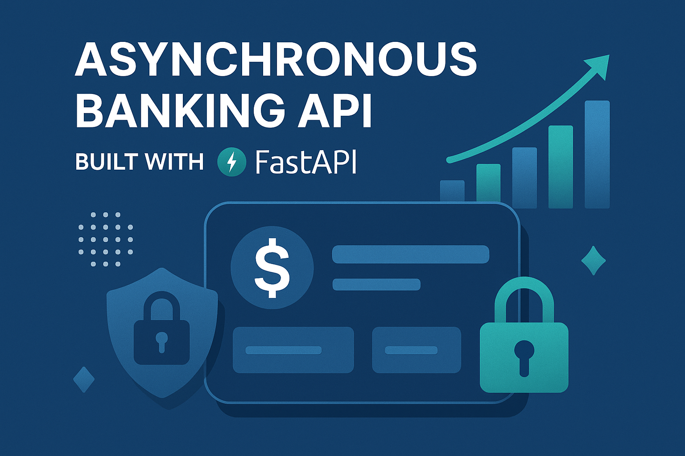
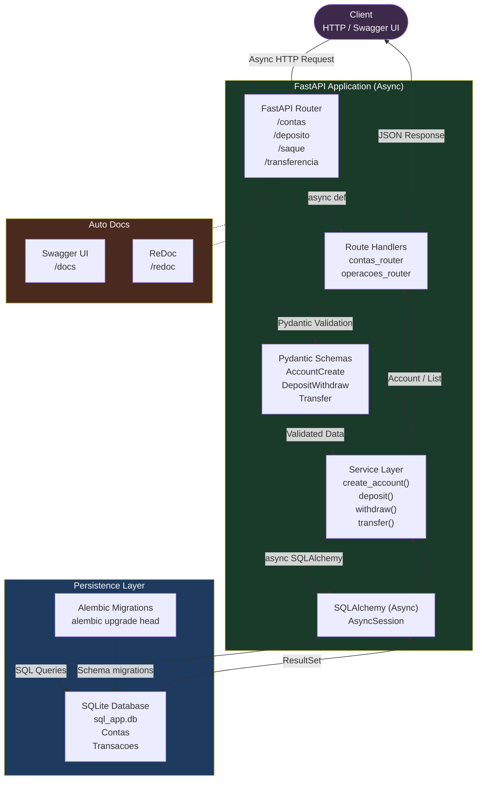
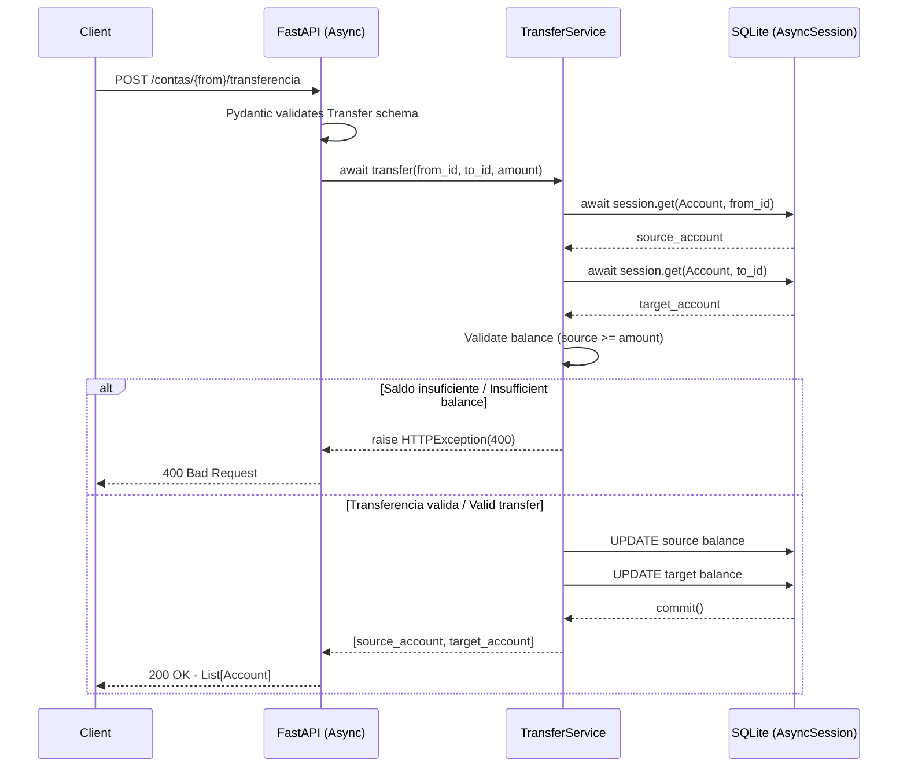

<p align="center">
  
</p>

<h1 align="center">🏦 API Bancária Assíncrona com FastAPI</h1>
<h3 align="center">Construindo uma API Bancária de Alta Performance com Python</h3>

<p align="center">
  </a>
  
  
  
</p>

---

## Arquitetura Assincrona | Async Architecture



---

## Fluxo de Transferencia | Transfer Flow



---

## 🇧🇷 Português

Seja muito bem-vindo(a) ao meu projeto de construção de uma **API bancária assíncrona**, desenvolvido com base na trilha de Python da DIO! 🚀

Neste projeto, aplico os principais conceitos de desenvolvimento backend moderno, com ênfase em **alta performance, organização de código e uso de boas práticas com FastAPI**.

### 🎯 Objetivo

O principal objetivo deste projeto é simular operações bancárias básicas de forma eficiente e segura, utilizando as capacidades assíncronas do FastAPI. As funcionalidades incluem:

-   **Criação de Contas:** Registro de novas contas bancárias com um número de conta único e nome do titular.
-   **Depósitos:** Adição de fundos a uma conta específica.
-   **Saques:** Retirada de fundos de uma conta, com validação de saldo.
-   **Consultas de Saldo:** Verificação do saldo atual de uma conta.
-   **Transferências:** Movimentação de fundos entre duas contas, com validação de saldo na conta de origem.

### 🧪 Tecnologias Utilizadas

Este projeto faz uso das seguintes tecnologias e bibliotecas:

-   **Python 3.11+**: Linguagem de programação principal.
-   **FastAPI**: Framework web moderno e rápido para construção de APIs.
-   **Uvicorn**: Servidor ASGI de alta performance.
-   **SQLAlchemy**: ORM (Object-Relational Mapper) para interação com o banco de dados.
-   **SQLite**: Banco de dados leve e integrado, utilizado para persistência de dados.
-   **Pydantic**: Biblioteca para validação de dados e serialização com Python type hints.
-   **Alembic**: Ferramenta de migração de banco de dados para SQLAlchemy.
-   **python-dotenv**: Para gerenciar variáveis de ambiente.
-   **Git & GitHub**: Controle de versão e hospedagem do código.

### 📁 Estrutura do Projeto

A estrutura do projeto foi organizada para promover a modularidade e a clareza, seguindo as melhores práticas de desenvolvimento de APIs:

```
📦 Criando-sua-API-Bancaria-Assincrona-com-FastAPI
 ┣ 📂 alembic/                  # Configurações e scripts de migração do Alembic
 ┣ 📂 app/
 ┃ ┣ 📂 models/               # Definições dos modelos de dados (SQLAlchemy)
 ┃ ┣ 📂 schemas/              # Schemas de validação e serialização (Pydantic)
 ┃ ┣ 📂 services/             # Lógica de negócios e operações do banco de dados
 ┃ ┣ 📂 routes/               # Definição dos endpoints da API (FastAPI)
 ┃ ┣ 📜 database.py           # Configuração da conexão com o banco de dados
 ┃ ┗ 📜 main.py               # Ponto de entrada da aplicação FastAPI
 ┣ 📂 docs/                   # Documentação adicional e ativos (ex: hero-image.png)
 ┣ 📜 .env.example            # Exemplo de arquivo de variáveis de ambiente
 ┣ 📜 .gitignore              # Arquivos e pastas a serem ignorados pelo Git
 ┣ 📜 alembic.ini             # Configuração principal do Alembic
 ┣ 📜 LICENSE                 # Licença do projeto
 ┣ 📜 README.md               # Este arquivo de documentação
 ┗ 📜 requirements.txt        # Dependências do projeto Python
```

### 🚀 Como Executar o Projeto

Siga os passos abaixo para configurar e executar a API localmente:

1.  **Clone o repositório:**
    ```bash
    git clone https://github.com/galafis/Criando-sua-API-Bancaria-Assincrona-com-FastAPI.git
    cd Criando-sua-API-Bancaria-Assincrona-com-FastAPI
    ```

2.  **Crie e ative o ambiente virtual:**
    ```bash
    python -m venv venv
    source venv/bin/activate  # No Windows use `venv\Scripts\activate`
    ```

3.  **Instale as dependências:**
    ```bash
    pip install -r requirements.txt
    ```

4.  **Configure as variáveis de ambiente:**
    Crie um arquivo `.env` na raiz do projeto com o seguinte conteúdo:
    ```
    DATABASE_URL=sqlite:///./sql_app.db
    ```

5.  **Execute as migrações do banco de dados:**
    ```bash
    alembic upgrade head
    ```

6.  **Inicie a aplicação:**
    ```bash
    uvicorn app.main:app --reload
    ```

    A API estará disponível em `http://localhost:8000`. Você pode acessar a documentação interativa (Swagger UI) em `http://localhost:8000/docs` ou a documentação ReDoc em `http://localhost:8000/redoc`.

### 🔗 Endpoints da API

| Método | Endpoint                     | Descrição                                    | Schema de Requisição       | Schema de Resposta       |
| :----- | :--------------------------- | :------------------------------------------- | :------------------------- | :----------------------- |
| `POST` | `/contas/`                   | Cria uma nova conta bancária.                | `AccountCreate`            | `Account`                |
| `GET`  | `/contas/{account_number}`   | Retorna os detalhes de uma conta específica. | -                          | `Account`                |
| `POST` | `/contas/{account_number}/deposito` | Realiza um depósito em uma conta.            | `DepositWithdraw`          | `Account`                |
| `POST` | `/contas/{account_number}/saque`    | Realiza um saque de uma conta.               | `DepositWithdraw`          | `Account`                |
| `POST` | `/contas/{from_account_number}/transferencia` | Realiza uma transferência entre contas.      | `Transfer`                 | `List[Account]`          |

### 🤝 Como Contribuir

Contribuições são muito bem-vindas! Se você deseja aprimorar este projeto, siga os passos:

1.  Faça um *fork* do repositório.
2.  Crie uma nova *branch* para sua funcionalidade ou correção (`git checkout -b feature/minha-funcionalidade`).
3.  Faça suas alterações e *commit* (`git commit -m 'feat: Adiciona nova funcionalidade'`).
4.  Envie suas alterações para o *fork* (`git push origin feature/minha-funcionalidade`).
5.  Abra um *Pull Request* detalhando suas mudanças.

### 📄 Licença

Este projeto está licenciado sob a Licença MIT. Veja o arquivo [LICENSE](LICENSE) para mais detalhes.

### 🧠 Sobre o Autor

Este projeto foi desenvolvido por **Gabriel Demetrios Lafis**, estudante e entusiasta de desenvolvimento backend com Python. Conecte-se comigo no [LinkedIn](https://www.linkedin.com/in/gabriel-demetrios-lafis/) ou explore outros projetos no meu [GitHub](https://github.com/galafis).

--- 

## 🇬🇧 English

Welcome to my project for building an **asynchronous banking API**, developed based on DIO's Python track! 🚀

In this project, I apply the main concepts of modern backend development, with an emphasis on **high performance, code organization, and the use of best practices with FastAPI**.

### 🎯 Objective

The main objective of this project is to simulate basic banking operations efficiently and securely, using FastAPI's asynchronous capabilities. Features include:

-   **Account Creation:** Registering new bank accounts with a unique account number and owner's name.
-   **Deposits:** Adding funds to a specific account.
-   **Withdrawals:** Withdrawing funds from an account, with balance validation.
-   **Balance Inquiries:** Checking the current balance of an account.
-   **Transfers:** Moving funds between two accounts, with balance validation in the source account.

### 🧪 Technologies Used

This project makes use of the following technologies and libraries:

-   **Python 3.11+**: Main programming language.
-   **FastAPI**: Modern and fast web framework for building APIs.
-   **Uvicorn**: High-performance ASGI server.
-   **SQLAlchemy**: ORM (Object-Relational Mapper) for database interaction.
-   **SQLite**: Lightweight and embedded database, used for data persistence.
-   **Pydantic**: Library for data validation and serialization with Python type hints.
-   **Alembic**: Database migration tool for SQLAlchemy.
-   **python-dotenv**: For managing environment variables.
-   **Git & GitHub**: Version control and code hosting.

### 📁 Project Structure

The project structure has been organized to promote modularity and clarity, following API development best practices:

```
📦 Criando-sua-API-Bancaria-Assincrona-com-FastAPI
 ┣ 📂 alembic/                  # Alembic configurations and migration scripts
 ┣ 📂 app/
 ┃ ┣ 📂 models/               # Data model definitions (SQLAlchemy)
 ┃ ┣ 📂 schemas/              # Data validation and serialization schemas (Pydantic)
 ┃ ┣ 📂 services/             # Business logic and database operations
 ┃ ┣ 📂 routes/               # API endpoint definitions (FastAPI)
 ┃ ┣ 📜 database.py           # Database connection configuration
 ┃ ┗ 📜 main.py               # FastAPI application entry point
 ┣ 📂 docs/                   # Additional documentation and assets (e.g., hero-image.png)
 ┣ 📜 .env.example            # Example environment variables file
 ┣ 📜 .gitignore              # Files and folders to be ignored by Git
 ┣ 📜 alembic.ini             # Main Alembic configuration
 ┣ 📜 LICENSE                 # Project license
 ┣ 📜 README.md               # This documentation file
 ┗ 📜 requirements.txt        # Python project dependencies
```

### 🚀 How to Run the Project

Follow the steps below to set up and run the API locally:

1.  **Clone the repository:**
    ```bash
    git clone https://github.com/galafis/Criando-sua-API-Bancaria-Assincrona-com-FastAPI.git
    cd Criando-sua-API-Bancaria-Assincrona-com-FastAPI
    ```

2.  **Create and activate the virtual environment:**
    ```bash
    python -m venv venv
    source venv/bin/activate  # On Windows use `venv\Scripts\activate`
    ```

3.  **Install dependencies:**
    ```bash
    pip install -r requirements.txt
    ```

4.  **Configure environment variables:**
    Create a `.env` file in the project root with the following content:
    ```
    DATABASE_URL=sqlite:///./sql_app.db
    ```

5.  **Run database migrations:**
    ```bash
    alembic upgrade head
    ```

6.  **Start the application:**
    ```bash
    uvicorn app.main:app --reload
    ```

    The API will be available at `http://localhost:8000`. You can access the interactive documentation (Swagger UI) at `http://localhost:8000/docs` or ReDoc documentation at `http://localhost:8000/redoc`.

### 🔗 API Endpoints

| Method | Endpoint                     | Description                                    | Request Schema             | Response Schema          |
| :----- | :--------------------------- | :------------------------------------------- | :------------------------- | :----------------------- |
| `POST` | `/contas/`                   | Creates a new bank account.                  | `AccountCreate`            | `Account`                |
| `GET`  | `/contas/{account_number}`   | Returns the details of a specific account.   | -                          | `Account`                |
| `POST` | `/contas/{account_number}/deposito` | Performs a deposit into an account.          | `DepositWithdraw`          | `Account`                |
| `POST` | `/contas/{account_number}/saque`    | Performs a withdrawal from an account.       | `DepositWithdraw`          | `Account`                |
| `POST` | `/contas/{from_account_number}/transferencia` | Performs a transfer between accounts.        | `Transfer`                 | `List[Account]`          |

### 🤝 How to Contribute

Contributions are very welcome! If you wish to improve this project, follow these steps:

1.  Fork the repository.
2.  Create a new branch for your feature or bugfix (`git checkout -b feature/my-feature`).
3.  Make your changes and commit (`git commit -m 'feat: Add new feature'`).
4.  Push your changes to your fork (`git push origin feature/my-feature`).
5.  Open a Pull Request detailing your changes.

### 📄 License

This project is licensed under the MIT License. See the [LICENSE](LICENSE) file for more details.

### 🧠 About the Author

This project was developed by **Gabriel Demetrios Lafis**, a student and enthusiast of backend development with Python. Connect with me on [LinkedIn](https://www.linkedin.com/in/gabriel-demetrios-lafis/) or explore other projects on my [GitHub](https://github.com/galafis).

